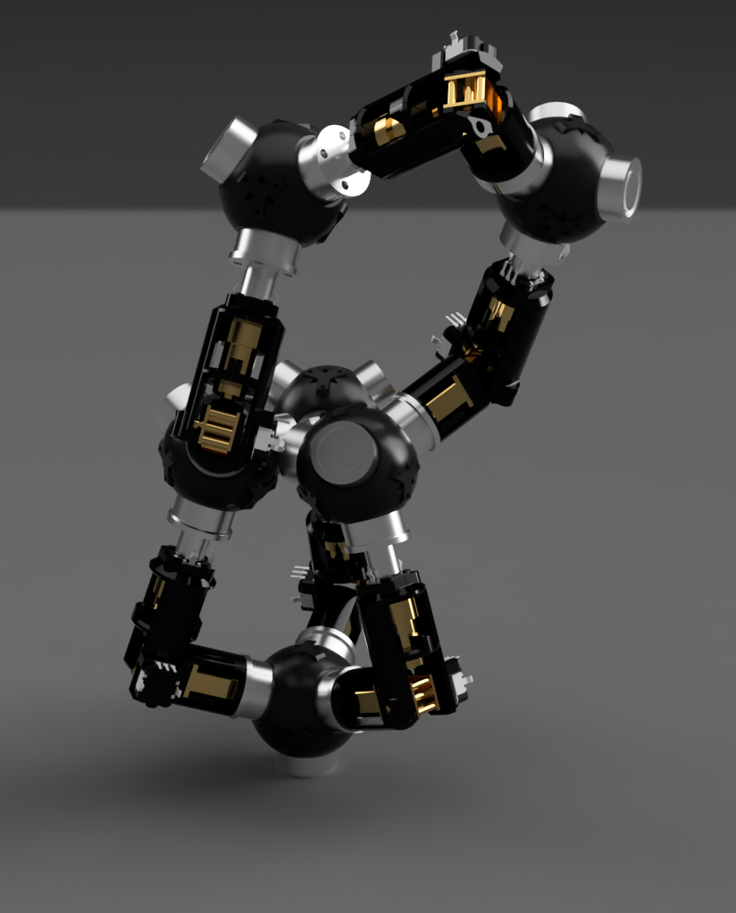
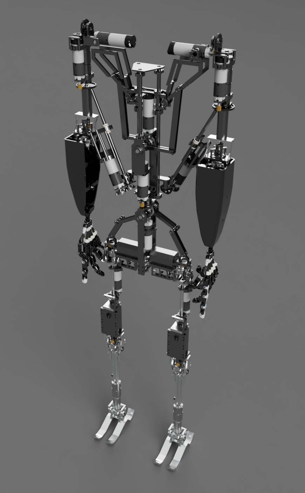
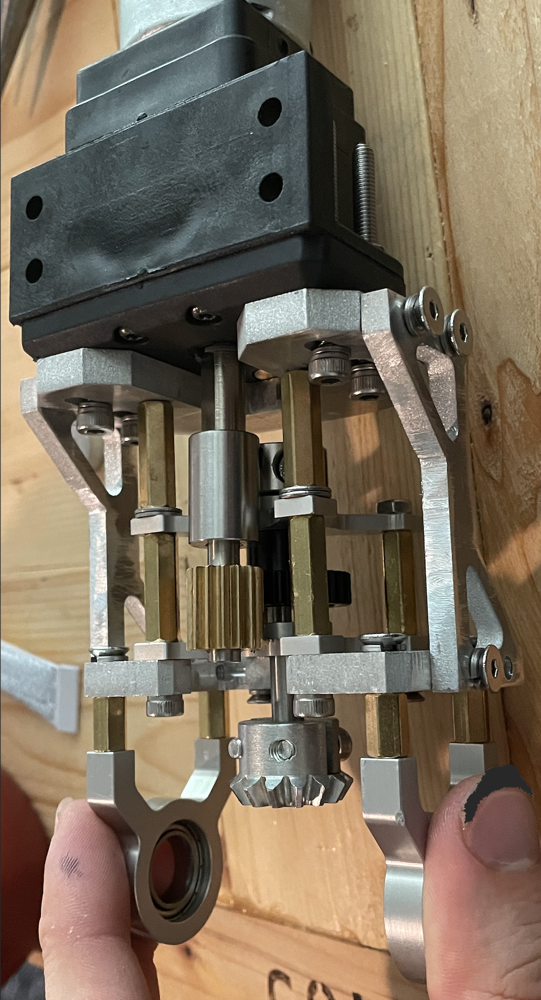
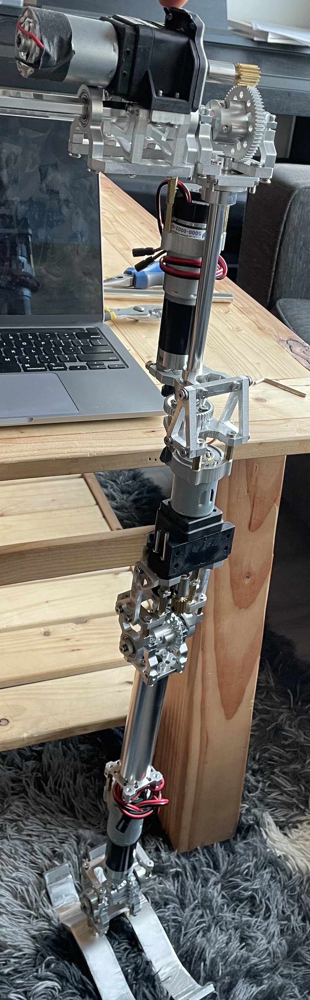
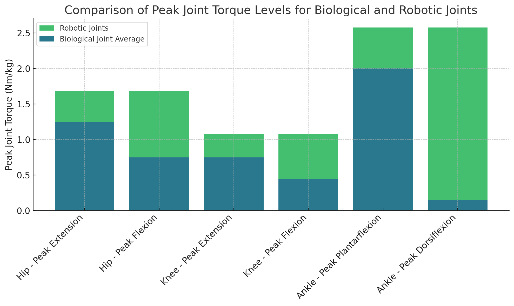
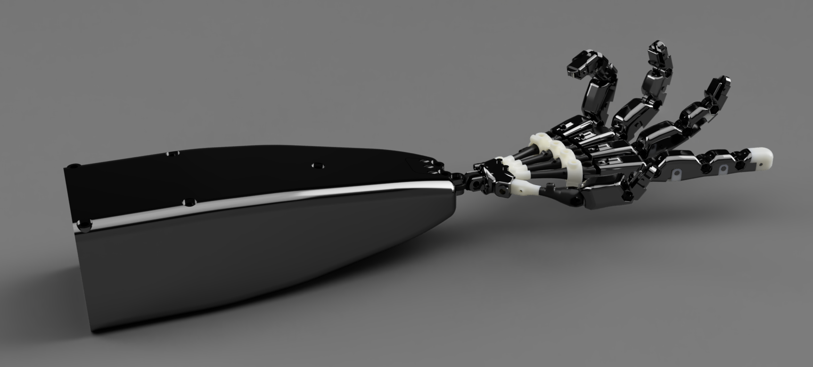
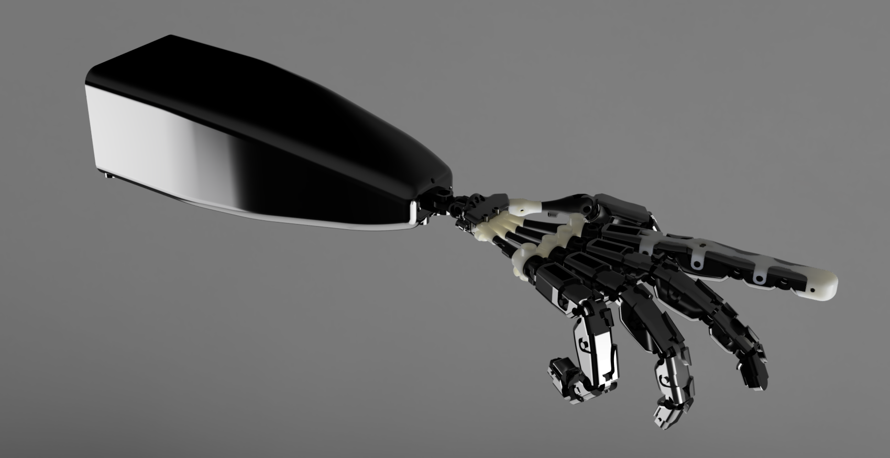

# Maker Projects

Here is a collection of my maker projects, ranging from mechanical designs to fully integrated robots with custom machining, PCBs, low-level control, GUI interfaces, and high-level planning with perception stacks. With every unfinished project, I've gained insights to avoid repeating those mistakes, and with every finished one, I get to capture some great photos! 

Special thanks to the [Invention Studio at Georgia Tech](https://inventionstudio.gatech.edu/), where I volunteer and bring many of these ideas to life. All of these overviews are very brief, so let me know if you have any questions!

---

  <!-- Project 0 -->
  

    <h2>Hydra: Self-Rearranging Robot</h2>
    
Fully Designed &middot; 30 Units Manufactured &middot; In-Simulation Controller &middot; RL Form-Based Controller

  

  
  <!-- Project 1 -->
  

    <h2>Icarus: Humanoid Robot</h2>
    
Fully Designed &middot; Hip-Down Manufactured &middot; Stress-Tested

  

  <!-- Project 2 -->
  

    <h2>FINGIE: 27 DoF Robotic Hand</h2>
    
Fully Designed &middot; Fully Manufactured &middot; Inverse-Kinematics

  

  <!-- Project 3 -->
  

    <h2>Dum-E: Modular Robotic Arm + Generalized End Effector</h2>
    
Fully Designed &middot; Fully Manufactured &middot; Custom PCBs &middot; Inverse-Kinematics

  

  <!-- Project 4 -->
  

    <h2>Axis: Autonomous Inverted Double Pendulum</h2>
    
Fully Designed &middot; Fully Manufactured &middot; Custom PCBs &middot; In-Simulation Controller

  

  <!-- Project 5 -->
  

    <h2>Falcon: Phone-Deployed Drone</h2>
    
Fully Designed &middot; Fully Manufactured

  

  <!-- Project 6 -->
  

    <h2>Apogex: High Altitude Rockoon</h2>
    
Fully Designed &middot; Fully Manufactured &middot; Autonomous Controller &middot; Launched to 36km

  

<!-- Modals -->

  

    <button class="close-btn" onclick="toggleModal('modal0')">&times;</button>
    <h2>Hydra: Self-Rearranging Robot</h2>
    

      

        <h3>Motivation</h3>
        
Humans have shaped the world to suit our needs, creating a utilitarian environment we can inhabit. Anthropomorphic robotics, therefore, serves as a natural bridge to generalized robotics—capable of using the same tools and spaces, and thus performing the same tasks as we do. However, robotics has the potential to achieve much more. What if robots weren't constrained by form? What if they could navigate any conceivable space, grasp objects of any shape, and serve and manipulate any tool? Amorphic robotics opens up every niche in our world — offering possibilities beyond what evolution could provide.

        <h3>Design Overview</h3>
        
All self-rearranging robots currently are prohibitively large, move very slowly, and have horribly insufficient control systems. I want to solve all of these problems. I decided to use <em>edges</em> and <em>nodes</em>. Nodes have four electromagnets which can be controlled, and edges can rotate, extend, and flex, with magnetic terminals on each side. This enables self-rearrangement and unrestricted movement. The mechanical and electrical design allows for sub-cm length of edges and 10mm width in each node-edge subsystem.

      

      

        
      

    

    <!-- Move "Some Challenges" section here -->
    <h3>Some Challenges</h3>
    
This project is ongoing, so not all of the challenges are known yet, but below are a few that caused me pain...

    <ul>
      <li><strong>Permanent Magnets</strong>: Since the batteries are self-contained within the nodes (and also communicate power via pogo pin contact points to the edges), we want to minimize power usage. Thus, we don't want energy draw when the electromagnets are in contact (i.e. <em>on</em>). So, instead of traditional electromagnets which are on when current is sent through them, I had to use permanent magnets which are off when current is sent through them. Unfortunately, these do not exist for purchase in the size I need, so I manufactured them. To do this, I designed and manufactured a spooling mechanism and computed the solenoid dimensions to generate a specific holding force of the magnet. This necessary holding force was computed through stochastic guarantees on the cumulative force of lattice structures that the overall system could generate. This garauntee is quite cool as there is feedback between torque profiles in the motor, the weight of the motors, and the peak carrying weight of the magnets and their own weight so it turns into an optimization problem!</li>
      <li><strong>Position Control of Motors</strong>: The motors used are micro-DC motors which cost about $1 each with custom planetary gearboxes (for the motor responsible for rotation) and wormgear drives (for the motor responsible for extension/flexion) and unfortunately are too small to have any encoder setup that I could simply buy. As such, I had to use coin encoders (which only have an accuracy of 180 degrees) and embed them into the back-shaft inside the micro-DC motor. To do this, I had to reconstruct the shell of the motor, which required me to bend zinc sheets very precisely and mount the encoders as part of the body of the motor.</li>
      <li><strong>Parallelized Simulation</strong>: Previous attempts at large-scale self-reassembling robots generally used search algorithms and basic movement primitive structures. But, based on work at the AMBER Lab, I was curious about how we could reduce the high-dimensional decision space of this control system (since it has massive state spaces) using reinforcement learning (RL). I thus set up IsaacSim in a Dockerized container and hosted it on a virtual GPU (since I cannot afford the multi-thousand dollar price tag to buy one). I wrote custom physics for the attachment and reorganization of nodes and edges. I'm currently experimenting with different hierarchically stacked RL-based controllers.</li>
    </ul>
  

  

    <button class="close-btn" onclick="toggleModal('modal1')">&times;</button>
    <h2>Icarus: Humanoid Robot</h2>
    <!-- First section with text on the left and image on the right -->
    

      

        <h3> Challenges </h3>
        
You'll notice that I did not use the typical cylindrical motors to actuate the joints. This was due to cost - each of those (e.g. Unitree B1) are $8,000+ which are personally unafordable. Instead, I decided to build in the motors to the skeletal structure of the robot. This posed a massive mechanical engineering challenge as parameterizing the model is now nearly impossible. I built an API that plugs into my Fusion 360 for this that draws on available dimensions from Servocity, where I sourced the motors. This enables parameterization of limb lengths so that I can optimize stress profiles in FEA in Fusion 360.
        <h3> Objectives </h3>
        A main objectives that I gave myself for this project was to try to mimic the motion patterns of humanoid joints as closely as possible. A good example of this is the scapular motion, which does not follow a typical fixed radius arc. Instead is moves approximately linearly until an inflection point at which it translates to an arc of approximately fixed radius. To mimic this, I used linear rails with linear bearings with pendulum-esque structures actuated by a central motor. On the linear rails, there are stiff springs. As the linear rail (attached to the shoulders) move up the rail linearly, they quickly collide with the springs, which then translate the motion to an arc.  
        Similarly, shoulder abduction (generally controlled by the supraspinatus and lateral middle deltoid muscles) are controlled by linear rails themselves actuated by in-line motors attached to the spine via universal joints which allows for full range of motion.
        <h3> Optimizations </h3>
        The entire assembly had to be low-cost. Because of the in-line motor design and the entirely custom gearboxes, it is able to be assembled at the cost of approximately $3,000. To achieve this, I had to design a Fusion 360 widget to automatically parameterize and generate crown gearboxes since I needed to translate axial motion from the motors which is in-line with the joints to a perpendicular motion which also controlling the exact torque profiles of the joints.  
        The use of custom-coded widgets was especially useful because I was computing the necessary torque profiles of the different joints through walking simulation in MuJoCo. The walking dynamics were manually defined in the beginning after a long attempt using Pinocchio.
        <h3> Manufacturing </h3>
        

      

      

        
      

    

    <h3>Manufacturing</h3>
    

        Due to budget constraints, I was only able to manufacture the hip-down parts. Below, I showcase one of the legs and the knee joint. All of the parts were manufactured from aluminum (a fastener for the ankle was steel due to shearing concerns) using a 5-axis CNC for 3D parts and a waterjet for the 2D parts.
    

    <!-- Third set of side-by-side images -->
    

        
        
    

    <h3>Stress-Test</h3>
    
After simulating necessary joint torque values, I evaluated how well the manufactured joints matched. Compared to simulated values, the resulting torque profiles were near identical. Below is an interesting comparison to humanoid joint profiles, which the robotic joints universally out perform.

    <!-- Single full-width image -->
    
  

  

    <button class="close-btn" onclick="toggleModal('modal2')">&times;</button>
    <h2>FINGIE: 27 DoF Robotic Hand</h2>
    

        
        
    

  

  

    <button class="close-btn" onclick="toggleModal('modal3')">&times;</button>
    <h2>Dum-E: Modular Robotic Arm</h2>
    
    
Detailed description of Dum-E project goes here.

  

  

    <button class="close-btn" onclick="toggleModal('modal4')">&times;</button>
    <h2>Axis: Autonomous Inverted Double Pendulum</h2>
    
    
Detailed description of Axis project goes here.

  

  

    <button class="close-btn" onclick="toggleModal('modal5')">&times;</button>
    <h2>Falcon: Phone-Deployed Drone</h2>
    
    
Detailed description of Falcon project goes here.

  

  

    <button class="close-btn" onclick="toggleModal('modal6')">&times;</button>
    <h2>Apogex: High Altitude Rockoon</h2>
    
    
Detailed description of Apogex project goes here.

  

<!-------------------------------------------- JS & Stylings -------------------------------------------->

<!-- JavaScript for Modal Toggle -->

<!-- CSS for the modal and portfolio grid -->
<!-- CSS for the modal and portfolio grid with fade-in/out effect and adjusted text sizes -->

